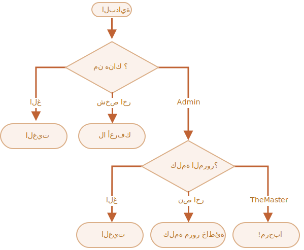

الأهمية: 3

---

# فحص تسجيل الدخول

أكتب كود يكلب تسجيل الدخول باستخدام `prompt`.

إذا كتب المستخدم كلمة `"Admin"` اطلب منه `prompt` كلمة المرور فإذا كتب سطر فارغ أو استخدم `key:Esc` -- أظهر رسالة "الغيت" وإذا كان نص آخر أظهر له "لا أعرفك".

يتم فحص كلمة المرور كالتالي:

- إذا كانت تساوي "TheMaster" يتم عرض "مرحبا!",
- نص آخر يتم عرض "كلمة مرور خاطئة",
- نص فارغ أو إلغاء العملية يتم عرض "الغيت"

الصيغة العامة:

استخدم تعبيرات `if` متداخلة. انتبه أن يكون الكود مقروء.

ملحوظة:  تمرير نص فارغ إلى prompt يرجع نص فارغ `''`. تمرير `key:ESC` يرجع `null`.

[demo]
